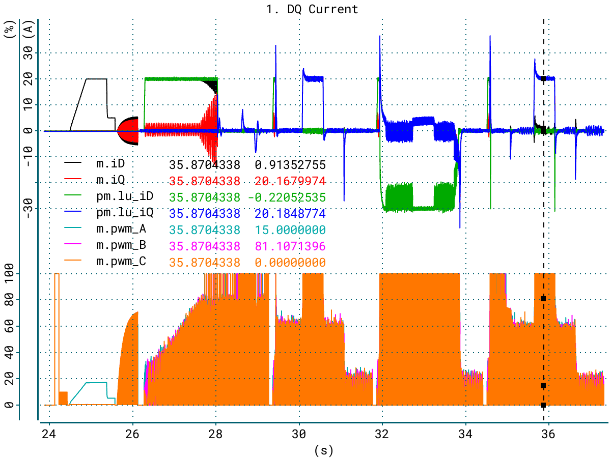
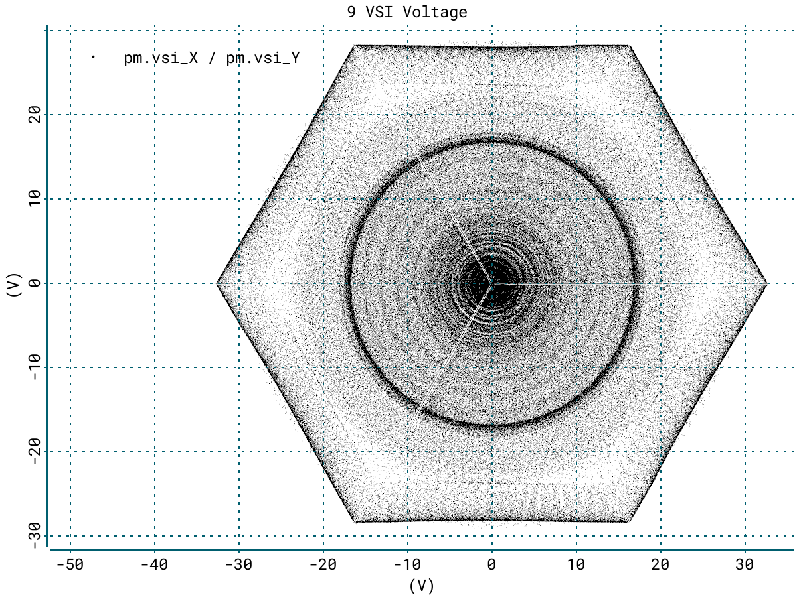

# Graph Plotter

GP is aimed to be simple and fast tool to analyse numerical data. It does not
claim to replace all other plotters.

## Features

* Plot 2D figures with lines or dots from plain text or binary files.
* Spatial structure based rendering to look through a large datasets.
* Multiple axes are supported by design.
* Real-time plotting from multiple asynchronous sources.
* Simple math operations like subtraction or polynomial fitting.
* Data pick tool to extract accurate numeric values.
* Static (from file) and dynamic (from UI) configuration.
* Export screen or data to the file (PNG, SVG, CSV).

The main platforms are GNU/Linux and Windows. GP can be embedded to any
third-party SDL2 based application.

## Screenshots

## Build

Here are the dependencies that you need to have prior to compile.

* [SDL2](https://www.libsdl.org/)
* [SDL2_ttf](https://www.libsdl.org/projects/SDL_ttf/)
* [SDL2_image](https://www.libsdl.org/projects/SDL_image/)
* [FreeType](https://www.freetype.org/)

To compile GP you could use Makefile from source directory.

## Usage

You can just use GP with a plain text files or CSV tables.

	$ gp file1.txt file2.csv ...

Note that first valid line of plain text (or CSV) file will be interpreted as
description of the columns. Here is a simple example of the plain text file.

	$ cat file1.txt
	time@sec  var1@A  var2@V  hexpar@  ...
	0.1       0.0     0.0     0x0001
	0.2       1.1     2.1     0x0035
	0.3       1.5     3.4     0x0d1f
	0.4       1.7     4.1     0x0e00
	...

You also can open a multiple files from UI to combine various columns from
different files in a single plot. Also check for command line options help.

	$ gp -h

## Regular configuration

Take a look into configuration examples that describes most of the options.

* [global.gp](config/global.gp)
* [loadbin.gp](config/loadbin.gp)
* [loadcsv.gp](config/loadcsv.gp)

## Live configuration

You can make real-time plot from raw serial device or from growing logfile.

* [serial.gp](config/serial.gp)

## TODO

* Improve embedded API.
* Add a dependency based subtract calculation.
* Optimize line drawing performance even more.

